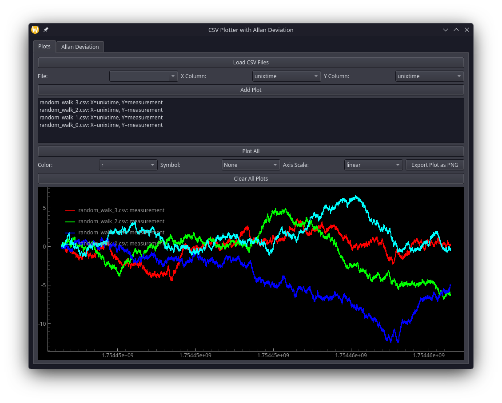
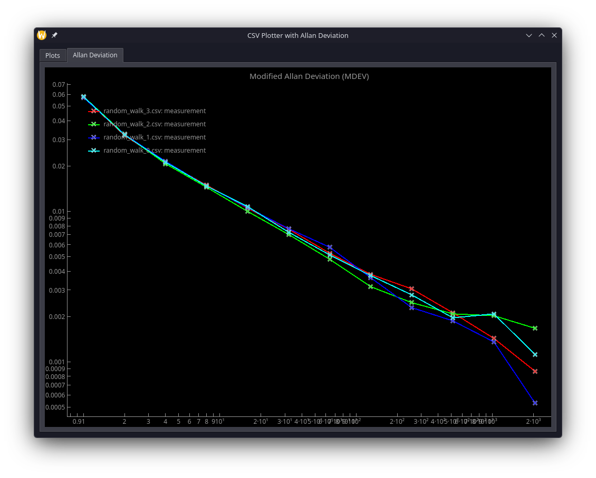

# ChronoPlotter

ChronoPlotter is a fast, PyQt6-based desktop application designed for engineers and researchers to visualize time-series CSV data and seamlessly compute the Modified Allan Deviation (MDEV). 

Whether you are analyzing oscillator stability, network timing synchronization (e.g., PTP offsets), or general noisy time-series data, this tool provides a highly responsive interface for overlaying datasets and extracting frequency stability metrics.

## Features

* **Multi-File Processing:** Load multiple CSVs concurrently using Python's multiprocessing pool to handle large datasets efficiently.
* **Interactive Plotting:** Powered by `pyqtgraph` for hardware-accelerated, real-time panning and zooming.
* **Custom Overlays:** Plot multiple variables from different CSVs on the same axis with customizable colors, symbols, and linear/logarithmic scale toggling.
* **Automated Allan Deviation:** Automatically calculates and generates a Log-Log plot of the Modified Allan Deviation for every active time-series dataset using the `allantools` library.
* **Export Capabilities:** Instantly export your generated plot views to PNG for reports and documentation.

## Requirements

Ensure you have Python 3.8+ installed. The required dependencies are listed below:

* `PyQt6`
* `pyqtgraph`
* `pandas`
* `numpy`
* `allantools`

You can install all dependencies via pip:
```bash
pip install PyQt6 pyqtgraph pandas numpy allantools

```

## Usage

1. Clone the repository and navigate to the project directory.
2. Run the main application script:

```bash
python main.py

```

3. Click **Load CSV Files** to import your data.
4. Select the target file, your X-Axis column (e.g., Time), and your Y-Axis column (e.g., Phase Offset).
5. Click **Add Plot**. Repeat for as many datasets as you wish to overlay.
6. Click **Plot All** to render the time-series graph.
7. Switch to the **Allan Deviation** tab to view the calculated stability metrics.

## GUI Images



